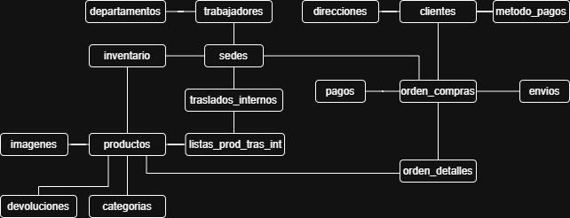
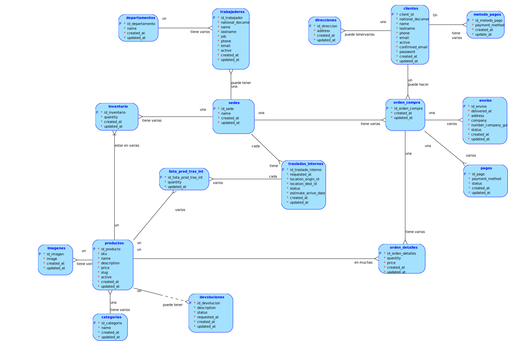
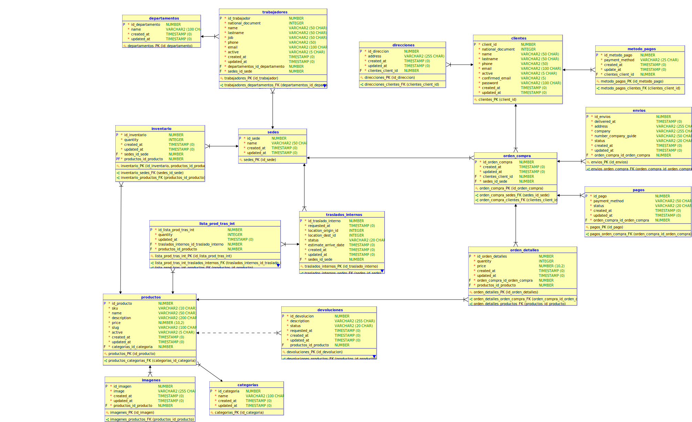

# <center>Manual Técnico</center>

### <center>Mario Ernesto Marroquín Pérez - 202110509

---

# Descripción del Proyecto

En el contexto de los sistemas de comercio electrónico, la gestión eficiente de datos es fundamental para garantizar el correcto funcionamiento de las operaciones de compra, venta y distribución de productos. Este proyecto tiene como objetivo el diseño y desarrollo de una base de datos relacional eficiente y normalizada para un centro de ventas en línea de gran escala, similar a plataformas como Amazon o Alibaba.

---

# Herramientas Utilizadas

- **Lenguaje de Programación:** Python
- **Frameworks:** FastAPI
- **Base de Datos**: Oracle
- **IDE:** Visual Studio Code
- **Control de Versiones**: Git y GitHub

---

# Requisitos del Sistema

- Sistema Operativo: Windows 10 o superior, Ubuntu 24.04
- Memoria RAM: Mínimo 4 GB
- Espacio en Disco: Mínimo 500 MB
- Software Adicional: Oracle Database, Python 3.8 o superior, DBeaver

---

# Modelo Conceptual



---

# Modelo Lógico



---

# Modelo Físico



---

# Proceso de Normalización

## Fases del Proceso de Normalización

La normalización es un proceso estructurado para organizar los datos en una base de datos y evitar redundancias e inconsistencias. A continuación, se explican las tres formas normales aplicadas a las tablas del sistema.

## **Primera Forma Normal (1NF)**

**Regla:**

- Los datos deben estar en una tabla con filas y columnas bien definidas.
- Cada columna debe contener valores atómicos (no multivaluados).
- Cada fila debe ser única, con una clave primaria identificadora.

Tabla clientes antes de la 1NF

| client_id | national_document | name | lastname | phone | email | addresses |
| --- | --- | --- | --- | --- | --- | --- |
| 1 | 123456789 | Juan | Pérez | 555-1234 | [juan@example.com](mailto:juan@example.com) | "Calle 1, Calle 2" |
| 2 | 987654321 | María | López | 555-5678 | [maria@example.com](mailto:maria@example.com) | "Calle 3" |

**Problema:**

- La columna addresses almacena múltiples valores en una sola celda, lo que viola la atomicidad.

**Tabla en 1NF:**

| client_id | national_document | name | lastname | phone | email |
| --- | --- | --- | --- | --- | --- |
| 1 | 123456789 | Juan | Pérez | 555-1234 | [juan@example.com](mailto:juan@example.com) |
| 2 | 987654321 | María | López | 555-5678 | [maria@example.com](mailto:maria@example.com) |

**Nueva tabla para direcciones:**

| id_direccion | client_id | address |
| --- | --- | --- |
| 1 | 1 | Calle 1 |
| 2 | 1 | Calle 2 |
| 3 | 2 | Calle 3 |

Ahora cada dirección está en una fila separada, cumpliendo la 1NF.

## **Segunda Forma Normal (2NF)**

**Regla:**

- Debe cumplir la 1NF.
- Elimina dependencias parciales. Esto significa que toda columna no clave debe depender completamente de la clave primaria.

Tabla orden_detalles antes de la 2NF

| order_id | product_id | product_name | quantity | price |
| --- | --- | --- | --- | --- |
| 1 | 101 | Laptop | 2 | 800 |
| 1 | 102 | Mouse | 1 | 20 |

**Problema:**

- product_name depende solo de product_id, no de order_id, lo que genera redundancia.

**Tabla en 2NF:**

| order_id | product_id | quantity | price |
| --- | --- | --- | --- |
| 1 | 101 | 2 | 800 |
| 1 | 102 | 1 | 20 |

Nueva tabla para productos:

| product_id | product_name |
| --- | --- |
| 101 | Laptop |
| 102 | Mouse |

## **Tercera Forma Normal (3NF)**

**Regla:**

- Debe cumplir la 2NF.
- Elimina dependencias transitivas (una columna no clave no debe depender de otra columna no clave).

Tabla clientes antes de la 3NF

| client_id | name | lastname | phone | email | city | state |
| --- | --- | --- | --- | --- | --- | --- |
| 1 | Juan | Pérez | 5551234 | [juan@example.com](mailto:juan@example.com) | Lima | Perú |
| 2 | María | López | 5555678 | [maria@example.com](mailto:maria@example.com) | Bogotá | Colombia |

**Problema:**

- state depende de city, no de client_id, lo que genera una dependencia transitiva.

**Tabla en 3NF:**

| client_id | name | lastname | phone | email | city_id |
| --- | --- | --- | --- | --- | --- |
| 1 | Juan | Pérez | 5551234 | [juan@example.com](mailto:juan@example.com) | 1 |
| 2 | María | López | 5555678 | [maria@example.com](mailto:maria@example.com) | 2 |

Nueva tabla para ciudades:

| city_id | city | state |
| --- | --- | --- |
| 1 | Lima | Perú |
| 2 | Bogotá | Colombia |

Con esta separación, state ya no está directamente en clientes, eliminando la dependencia transitiva.

---

## **Proceso de Normalización - Tabla Trabajadores**

### **Forma No Normalizada**

| trabajador_id | nacional_documento | nombre | apellido | cargo | departamento | telefono | email | sede | activo |
| --- | --- | --- | --- | --- | --- | --- | --- | --- | --- |
| 1 | 12345678 | Juan | Pérez | Administrador | Recursos Humanos | 555-123456 | juan@empresa.com | - | TRUE |
| 2 | 87654321 | María | López | Almacén | Logística | 555-654321 | maria@empresa.com | Sede Central | TRUE |
| 3 | 56781234 | Carlos | Ramírez | Transporte | Logística | 555-789123 | carlos@empresa.com | Sede Norte | FALSE |
| 4 | 43218765 | Ana | Gómez | Analista | Finanzas | 555-321987 | ana@empresa.com | - | TRUE |

### 1NF (Primera Forma Normal)

### Reglas aplicadas:

- Cada columna almacena un solo valor atómico.
- Cada fila tiene un identificador único.
- Eliminamos grupos repetitivos (departamentos y sedes en la misma tabla).

### Nueva tabla trabajadores

Ahora, los departamentos y sedes se referencian por un ID en lugar del nombre.

| trabajador_id | nacional_documento | nombre | apellido | cargo | departamento_id | telefono | email | sede_id | activo |
| --- | --- | --- | --- | --- | --- | --- | --- | --- | --- |
| 1 | 12345678 | Juan | Pérez | Administrador | 1 | 555-123456 | juan@empresa.com | NULL | TRUE |
| 2 | 87654321 | María | López | Almacén | 2 | 555-654321 | maria@empresa.com | 1 | TRUE |
| 3 | 56781234 | Carlos | Ramírez | Transporte | 2 | 555-789123 | carlos@empresa.com | 2 | FALSE |
| 4 | 43218765 | Ana | Gómez | Analista | 3 | 555-321987 | ana@empresa.com | NULL | TRUE |

### **Nueva tabla departamentos**

| departamento_id | nombre |
| --- | --- |
| 1 | Recursos Humanos |
| 2 | Logística |
| 3 | Finanzas |

### **Nueva tabla sedes**

| sede_id | nombre |
| --- | --- |
| 1 | Sede Central |
| 2 | Sede Norte |

### **2NF (Segunda Forma Normal)**

### Reglas aplicadas:

- Eliminamos dependencias parciales (cada atributo depende completamente de la clave primaria).
- Creamos nuevas tablas para la relación entre trabajadores y sedes.
- En 1NF, la sede estaba en la tabla trabajadores, pero no todos los trabajadores tienen sede.
- Para mejorar, separamos la relación trabajadores-sedes en otra tabla.

### **Nueva tabla trabajadores (sin sede_id)**

| trabajador_id | nacional_documento | nombre | apellido | cargo | departamento_id | telefono | email | activo |
| --- | --- | --- | --- | --- | --- | --- | --- | --- |
| 1 | 12345678 | Juan | Pérez | Administrador | 1 | 555-123456 | juan@empresa.com | TRUE |
| 2 | 87654321 | María | López | Almacén | 2 | 555-654321 | maria@empresa.com | TRUE |
| 3 | 56781234 | Carlos | Ramírez | Transporte | 2 | 555-789123 | carlos@empresa.com | FALSE |
| 4 | 43218765 | Ana | Gómez | Analista | 3 | 555-321987 | ana@empresa.com | TRUE |

## **3NF (Tercera Forma Normal)**

### **Reglas aplicadas**:

- Eliminamos dependencias transitivas (datos que no dependen directamente de la clave primaria).
- Creamos una tabla para los cargos porque hay trabajadores con el mismo cargo.

### Nueva tabla trabajadores

| trabajador_id | nacional_documento | nombre | apellido | cargo_id | departamento_id | telefono | email | activo |
| --- | --- | --- | --- | --- | --- | --- | --- | --- |
| 1 | 12345678 | Juan | Pérez | 1 | 1 | 555-123456 | juan@empresa.com | TRUE |
| 2 | 87654321 | María | López | 2 | 2 | 555-654321 | maria@empresa.com | TRUE |
| 3 | 56781234 | Carlos | Ramírez | 3 | 2 | 555-789123 | carlos@empresa.com | FALSE |
| 4 | 43218765 | Ana | Gómez | 4 | 3 | 555-321987 | ana@empresa.com | TRUE |

---

## **Proceso de Normalización - Tabla Productos**

### **0NF (Forma No Normalizada)**

Aquí los datos no están organizados correctamente. Hay redundancia y dependencias innecesarias.

| producto_id | sku | nombre | descripción | precio | slug | cantidad | sede | categoría | activo | imagenes |
| --- | --- | --- | --- | --- | --- | --- | --- | --- | --- | --- |
| 1 | ABC123 | Laptop HP | 16GB RAM, SSD | 800.00 | laptop-hp | 10 | Sede Central | Computadoras | TRUE | img1.jpg, img2.jpg |
| 2 | XYZ456 | Mouse Logitech | Inalámbrico | 25.00 | mouse-logitech | 50 | Sede Norte | Accesorios | TRUE | img3.jpg |
| 3 | LMN789 | Monitor Dell | 24" LED Full HD | 200.00 | monitor-dell | 20 | Sede Central | Monitores | FALSE | img4.jpg, img5.jpg, img6.jpg |

### **1NF (Primera Forma Normal)**

### **Reglas aplicadas**:

- Cada columna almacena un solo valor atómico.
- Cada fila tiene un identificador único.
- Eliminamos listas separadas por comas y las pasamos a tablas relacionadas.

### Nueva tabla productos

| producto_id | sku | nombre | descripción | precio | slug | categoria_id | activo |
| --- | --- | --- | --- | --- | --- | --- | --- |
| 1 | ABC123 | Laptop HP | 16GB RAM, SSD | 800.00 | laptop-hp | 1 | TRUE |
| 2 | XYZ456 | Mouse Logitech | Inalámbrico | 25.00 | mouse-logitech | 2 | TRUE |
| 3 | LMN789 | Monitor Dell | 24" LED Full HD | 200.00 | monitor-dell | 3 | FALSE |

### Nueva tabla categorias

| categoria_id | nombre |
| --- | --- |
| 1 | Computadoras |
| 2 | Accesorios |
| 3 | Monitores |

### Nueva tabla sedes

Ahora los productos y sus cantidades en inventario están **separados** de la tabla principal.

| producto_id | sede_id | cantidad |
| --- | --- | --- |
| 1 | 1 | 10 |
| 2 | 2 | 50 |
| 3 | 1 | 20 |

### Nueva tabla imagenes

Ahora las imágenes de los productos están en una tabla aparte, eliminando listas dentro de una celda.

| imagen_id | producto_id | url |
| --- | --- | --- |
| 1 | 1 | img1.jpg |
| 2 | 1 | img2.jpg |
| 3 | 2 | img3.jpg |
| 4 | 3 | img4.jpg |
| 5 | 3 | img5.jpg |
| 6 | 3 | img6.jpg |

## **2NF (Segunda Forma Normal)**

### **Reglas aplicadas**:

- Eliminamos dependencias parciales.
- Cada dato depende completamente de la clave primaria.
- Creamos una tabla para precios en caso de historial de cambios.
- Separamos precios en una nueva tabla, ya que pueden cambiar con el tiempo.

### Nueva tabla precios_productos

| precio_id | producto_id | precio | fecha_aplicacion |
| --- | --- | --- | --- |
| 1 | 1 | 800.00 | 2024-03-05 |
| 2 | 2 | 25.00 | 2024-03-05 |
| 3 | 3 | 200.00 | 2024-03-05 |

Ahora podemos actualizar el precio sin afectar la tabla principal.

## **3NF (Tercera Forma Normal)**

### **Reglas aplicadas**:

- Eliminamos dependencias transitivas.
- La tabla productos solo tiene datos directamente relacionados con los productos.
- Aquí, slug es generado automáticamente a partir del nombre del producto y no necesita estar en la tabla principal.

### Nueva tabla productos

| producto_id | sku | nombre | descripción | categoria_id | activo |
| --- | --- | --- | --- | --- | --- |
| 1 | ABC123 | Laptop HP | 16GB RAM, SSD | 1 | TRUE |
| 2 | XYZ456 | Mouse Logitech | Inalámbrico | 2 | TRUE |
| 3 | LMN789 | Monitor Dell | 24" LED Full HD | 3 | FALSE |

---

## **Proceso de Normalización - Tabla Orden de Compra**

### **Primera Forma Normal (1FN)**

La Primera Forma Normal requiere que cada celda de la tabla contenga un valor atómico (no puede haber listas o conjuntos de valores) y que todas las columnas tengan un nombre único.

### Tabla de Ordenes_de_Compra

| id_orden | fecha_creacion | id_cliente | id_producto | cantidad | precio_unitario |
| --- | --- | --- | --- | --- | --- |
| 1 | 2025-03-05 | 1001 | 5001 | 2 | 20.00 |
| 1 | 2025-03-05 | 1001 | 5002 | 1 | 15.00 |
| 2 | 2025-03-06 | 1002 | 5003 | 3 | 30.00 |

### **Segunda Forma Normal (2FN)**

### Tabla de Ordenes_de_Compra (relacionada con la orden en general):

| id_orden | fecha_creacion | id_cliente |
| --- | --- | --- |
| 1 | 2025-03-05 | 1001 |
| 2 | 2025-03-06 | 1002 |

### Tabla de Detalle_Orden (relacionada con los productos de cada orden):

| id_orden | id_producto | cantidad | precio_unitario |
| --- | --- | --- | --- |
| 1 | 5001 | 2 | 20.00 |
| 1 | 5002 | 1 | 15.00 |
| 2 | 5003 | 3 | 30.00 |

### **Tercera Forma Normal (3FN)**

### Tabla de Ordenes_de_Compra

| id_orden | fecha_creacion | id_cliente |
| --- | --- | --- |
| 1 | 2025-03-05 | 1001 |
| 2 | 2025-03-06 | 1002 |

### Tabla de Detalle_Orden

| id_orden | id_producto | cantidad | precio_unitario |
| --- | --- | --- | --- |
| 1 | 5001 | 2 | 20.00 |
| 1 | 5002 | 1 | 15.00 |
| 2 | 5003 | 3 | 30.00 |

---

## **Proceso de Normalización - Tabla Traslados Internos**

### **Primera Forma Normal (1FN)**

### Tabla de Traslados

| id_traslado | fecha_movimiento | almacén_origen | almacén_destino | id_producto | cantidad | estado_traslado | fecha_estimada_llegada |
| --- | --- | --- | --- | --- | --- | --- | --- |
| 1 | 2025-03-05 | A001 | B001 | 5001 | 10 | En tránsito | 2025-03-07 |
| 1 | 2025-03-05 | A001 | B001 | 5002 | 5 | En tránsito | 2025-03-07 |
| 2 | 2025-03-06 | A002 | B002 | 5003 | 20 | Completado | 2025-03-08 |

### **Segunda Forma Normal (2FN)**

### Tabla de Traslados (información general del traslado):

| id_traslado | fecha_movimiento | almacén_origen | almacén_destino | estado_traslado | fecha_estimada_llegada |
| --- | --- | --- | --- | --- | --- |
| 1 | 2025-03-05 | A001 | B001 | En tránsito | 2025-03-07 |
| 2 | 2025-03-06 | A002 | B002 | Completado | 2025-03-08 |

### Tabla de Detalle_Traslado (información de los productos trasladados):

| id_traslado | id_producto | cantidad |
| --- | --- | --- |
| 1 | 5001 | 10 |
| 1 | 5002 | 5 |
| 2 | 5003 | 20 |

### **Tercera Forma Normal (3FN)**

### Tabla de Traslados:

| id_traslado | fecha_movimiento | almacén_origen | almacén_destino | estado_traslado | fecha_estimada_llegada |
| --- | --- | --- | --- | --- | --- |
| 1 | 2025-03-05 | A001 | B001 | En tránsito | 2025-03-07 |
| 2 | 2025-03-06 | A002 | B002 | Completado | 2025-03-08 |

### Tabla de Detalle_Traslado:

| id_traslado | id_producto | cantidad |
| --- | --- | --- |
| 1 | 5001 | 10 |
| 1 | 5002 | 5 |
| 2 | 5003 | 20 |

## **Conclusión**

Después de aplicar la normalización hasta la 3NF, hemos:

- Eliminados valores multivaluados.
- Separado dependencias parciales.
- Eliminado dependencias transitivas.

Esto garantiza que la base de datos sea eficiente y reduzca la redundancia, mejorando la integridad y consistencia de los datos.

---

# Matriz de Relaciones entre Tablas

| Tablas | clientes | direcciones | metodos_pago | categorias | departamentos | productos | imagenes | sedes | trabajadores | inventarios | traslados_internos | listas_prod_tras_int | orden_compras | orden_detalles | envios | pagos | devoluciones |
| --- | --- | --- | --- | --- | --- | --- | --- | --- | --- | --- | --- | --- | --- | --- | --- | --- | --- |
| clientes | 1 | tiene | tiene | No aplica | No aplica | No aplica | No aplica | No aplica | No aplica | No aplica | No aplica | No aplica | tiene | No aplica | No aplica | No aplica | No aplica |
| direcciones | tiene | 1 | No aplica | No aplica | No aplica | No aplica | No aplica | No aplica | No aplica | No aplica | No aplica | No aplica | No aplica | No aplica | No aplica | No aplica | No aplica |
| metodos_pago | tiene | No aplica | 1 | No aplica | No aplica | No aplica | No aplica | No aplica | No aplica | No aplica | No aplica | No aplica | No aplica | No aplica | No aplica | No aplica | No aplica |
| categorias | No aplica | No aplica | No aplica | 1 | No aplica | tiene | No aplica | No aplica | No aplica | No aplica | No aplica | No aplica | No aplica | No aplica | No aplica | No aplica | No aplica |
| departamentos | No aplica | No aplica | No aplica | No aplica | 1 | No aplica | No aplica | No aplica | tiene | No aplica | No aplica | No aplica | No aplica | No aplica | No aplica | No aplica | No aplica |
| productos | No aplica | No aplica | No aplica | pertenece | No aplica | 1 | tiene | No aplica | No aplica | tiene | No aplica | pertenece | No aplica | No aplica | No aplica | No aplica | puede ser devuelto |
| imagenes | No aplica | No aplica | No aplica | No aplica | No aplica | pertenece | 1 | No aplica | No aplica | No aplica | No aplica | No aplica | No aplica | No aplica | No aplica | No aplica | No aplica |
| sedes | No aplica | No aplica | No aplica | No aplica | No aplica | No aplica | No aplica | 1 | tiene | tiene | participa | No aplica | No aplica | No aplica | No aplica | No aplica | No aplica |
| trabajadores | No aplica | No aplica | No aplica | No aplica | pertenece | No aplica | No aplica | pertenece | 1 | No aplica | No aplica | No aplica | No aplica | No aplica | No aplica | No aplica | No aplica |
| inventarios | No aplica | No aplica | No aplica | No aplica | No aplica | maneja | No aplica | pertenece | No aplica | 1 | No aplica | No aplica | No aplica | No aplica | No aplica | No aplica | No aplica |
| traslados_internos | No aplica | No aplica | No aplica | No aplica | No aplica | No aplica | No aplica | participa | No aplica | No aplica | 1 | tiene productos | No aplica | No aplica | No aplica | No aplica | No aplica |
| listas_prod_tras_int | No aplica | No aplica | No aplica | No aplica | No aplica | pertenece | No aplica | No aplica | No aplica | No aplica | pertenece | 1 | No aplica | No aplica | No aplica | No aplica | No aplica |
| orden_compras | realizada | No aplica | No aplica | No aplica | No aplica | No aplica | No aplica | se hace en | No aplica | No aplica | No aplica | No aplica | 1 | tiene productos | No aplica | No aplica | No aplica |
| orden_detalles | No aplica | No aplica | No aplica | No aplica | No aplica | pertenece | No aplica | No aplica | No aplica | No aplica | No aplica | No aplica | pertenece | 1 | No aplica | No aplica | No aplica |
| envios | No aplica | No aplica | No aplica | No aplica | No aplica | No aplica | No aplica | No aplica | No aplica | No aplica | No aplica | No aplica | pertenece | pertenece | 1 | No aplica | No aplica |
| pagos | No aplica | No aplica | usa | No aplica | No aplica | No aplica | No aplica | No aplica | No aplica | No aplica | No aplica | No aplica | pertenece | No aplica | No aplica | 1 | No aplica |
| devoluciones | No aplica | No aplica | No aplica | No aplica | No aplica | pertenece | No aplica | No aplica | No aplica | No aplica | No aplica | No aplica | No aplica | No aplica | No aplica | No aplica | 1 |

---

# Implementación

En este proyecto se ha utilizado las convenciones de Oracle para la sintaxis de SQL.

## Descripción de las Tablas

### 1. clientes

Tabla que almacena la información de los clientes registrados en el sistema. Contiene datos personales, credenciales de acceso y estados de activación y confirmación de correo.

```sql
CREATE TABLE clientes (
    client_id NUMBER GENERATED ALWAYS AS IDENTITY PRIMARY KEY,
    national_document NUMBER NOT NULL UNIQUE,
    name VARCHAR2(50) NOT NULL,
    lastname VARCHAR2(50) NOT NULL,
    phone VARCHAR2(35) NOT NULL,
    email VARCHAR2(100) NOT NULL,
    active VARCHAR2(5) DEFAULT 'FALSE' NOT NULL,
    confirmed_email VARCHAR2(5) DEFAULT 'FALSE' NOT NULL,
    password VARCHAR2(255) NOT NULL,
    created_at TIMESTAMP DEFAULT CURRENT_TIMESTAMP NOT NULL,
    updated_at TIMESTAMP DEFAULT CURRENT_TIMESTAMP NOT NULL
);
```

### 2. direcciones

Relacionada con clientes, esta tabla guarda las direcciones asociadas a cada cliente.

```sql
CREATE TABLE direcciones (
    id_direccion NUMBER GENERATED ALWAYS AS IDENTITY PRIMARY KEY,
    client_id NUMBER NOT NULL,
    address VARCHAR2(255) NOT NULL,
    created_at TIMESTAMP DEFAULT CURRENT_TIMESTAMP NOT NULL,
    updated_at TIMESTAMP DEFAULT CURRENT_TIMESTAMP NOT NULL,
    CONSTRAINT fk_direccion_clientes FOREIGN KEY (client_id) REFERENCES clientes (client_id) ON DELETE CASCADE
);
```

### 3. metodos_pago

Registra los métodos de pago asociados a cada cliente, permitiendo múltiples formas de pago por usuario.

```sql
CREATE TABLE metodos_pago ( --pagos
    id_metodo_pago NUMBER GENERATED ALWAYS AS IDENTITY PRIMARY KEY,
    client_id NUMBER NOT NULL,
    payment_method VARCHAR2(50) NOT NULL,
    created_at TIMESTAMP DEFAULT CURRENT_TIMESTAMP NOT NULL,
    updated_at TIMESTAMP DEFAULT CURRENT_TIMESTAMP NOT NULL,
    CONSTRAINT fk_metodo_pagos_clientes FOREIGN KEY (client_id) REFERENCES clientes (client_id) ON DELETE CASCADE
);
```

### 4. categorias

Define las categorías de los productos disponibles en la tienda.

```sql
CREATE TABLE categorias (
    id_categoria NUMBER GENERATED ALWAYS AS IDENTITY PRIMARY KEY,
    name VARCHAR2(50) NOT NULL,
    created_at TIMESTAMP DEFAULT CURRENT_TIMESTAMP NOT NULL,
    updated_at TIMESTAMP DEFAULT CURRENT_TIMESTAMP NOT NULL
);
```

### 5. departamentos

Representa los diferentes departamentos dentro de la empresa, los cuales pueden estar relacionados con empleados.

```sql
CREATE TABLE departamentos (
    id_departamento NUMBER GENERATED ALWAYS AS IDENTITY PRIMARY KEY,
    name VARCHAR2(100) NOT NULL,
    created_at TIMESTAMP DEFAULT CURRENT_TIMESTAMP NOT NULL,
    updated_at TIMESTAMP DEFAULT CURRENT_TIMESTAMP NOT NULL
);
```

### 6. productos

Contiene la información de los productos disponibles, incluyendo su categoría, descripción, precio y estado de disponibilidad.

```sql
CREATE TABLE productos (
    id_producto NUMBER GENERATED ALWAYS AS IDENTITY PRIMARY KEY,
    category_id NUMBER NOT NULL,
    sku VARCHAR2(50) NOT NULL,
    name VARCHAR2(100) NOT NULL,
    description VARCHAR2(255) NOT NULL,
    price NUMBER NOT NULL,
    slug VARCHAR2(100) NOT NULL,
    active VARCHAR2(5) DEFAULT 'FALSE' NOT NULL,
    created_at TIMESTAMP DEFAULT CURRENT_TIMESTAMP NOT NULL,
    updated_at TIMESTAMP DEFAULT CURRENT_TIMESTAMP NOT NULL,
    CONSTRAINT fk_producto_categoria FOREIGN KEY (category_id) REFERENCES categorias (id_categoria) ON DELETE CASCADE
);
```

### 7. imagenes

Relacionada con productos, esta tabla almacena las imágenes asociadas a cada producto.

```sql
CREATE TABLE imagenes(
    id_imagen NUMBER GENERATED ALWAYS AS IDENTITY PRIMARY KEY,
    product_id NUMBER NOT NULL,
    image VARCHAR2(255) NOT NULL,
    created_at TIMESTAMP DEFAULT CURRENT_TIMESTAMP NOT NULL,
    updated_at TIMESTAMP DEFAULT CURRENT_TIMESTAMP NOT NULL,
    CONSTRAINT fk_imagen_producto FOREIGN KEY (product_id) REFERENCES productos (id_producto) ON DELETE CASCADE 
);
```

### 8. sedes

Guarda la información de las sedes o sucursales de la empresa.

```sql
CREATE TABLE sedes (
    id_sede NUMBER GENERATED ALWAYS AS IDENTITY PRIMARY KEY,
    name VARCHAR2(100) NOT NULL,
    created_at TIMESTAMP DEFAULT CURRENT_TIMESTAMP NOT NULL,
    updated_at TIMESTAMP DEFAULT CURRENT_TIMESTAMP NOT NULL
);

```

### 9. trabajadores

Registra la información del personal de la empresa, vinculando cada trabajador con una sede y un departamento.

```sql
CREATE TABLE trabajadores (
    id_trabajador NUMBER GENERATED ALWAYS AS IDENTITY PRIMARY KEY, 
    location_id NUMBER NOT NULL,
    department_id NUMBER NOT NULL,
    national_document NUMBER NOT NULL UNIQUE,
    name VARCHAR2(50) NOT NULL,
    lastname VARCHAR2(50) NOT NULL,
    job VARCHAR2(50) NOT NULL,
    phone VARCHAR2(35) NOT NULL,
    email VARCHAR2(100) NOT NULL UNIQUE,
    active VARCHAR2(5) DEFAULT 'FALSE' NOT NULL,
    created_at TIMESTAMP DEFAULT CURRENT_TIMESTAMP NOT NULL,
    updated_at TIMESTAMP DEFAULT CURRENT_TIMESTAMP NOT NULL,
    CONSTRAINT fk_trabajador_sede FOREIGN KEY (location_id) REFERENCES sedes (id_sede) ON DELETE CASCADE,
    CONSTRAINT fk_trabajador_departamento FOREIGN KEY (department_id) REFERENCES departamentos (id_departamento) ON DELETE CASCADE
);
```

### 10. inventarios

Relaciona productos con sedes, indicando la cantidad disponible de cada producto en cada ubicación.

```sql
CREATE TABLE inventarios (
    id_inventario NUMBER GENERATED ALWAYS AS IDENTITY PRIMARY KEY,
    location_id NUMBER NOT NULL,
    product_id NUMBER NOT NULL, 
    quantity NUMBER NOT NULL,
    created_at TIMESTAMP DEFAULT CURRENT_TIMESTAMP NOT NULL,
    updated_at TIMESTAMP DEFAULT CURRENT_TIMESTAMP NOT NULL,
    CONSTRAINT fk_inventario_sede FOREIGN KEY (location_id) REFERENCES sedes (id_sede) ON DELETE CASCADE,
    CONSTRAINT fk_inventario_producto FOREIGN KEY (product_id) REFERENCES productos (id_producto) ON DELETE CASCADE
);

```

### 11. traslados_internos

Registra los movimientos de productos entre sedes, permitiendo rastrear cambios de ubicación de inventario.

```sql
CREATE TABLE traslados_internos ( --movimientos
    id_traslado_interno NUMBER GENERATED ALWAYS AS IDENTITY PRIMARY KEY,
    requested_at TIMESTAMP NOT NULL,
    location_origin_id NUMBER NOT NULL,
    location_dest_id NUMBER NOT NULL,
    status VARCHAR2(25) NOT NULL,
    estimate_arrive_date TIMESTAMP NOT NULL,
    created_at TIMESTAMP DEFAULT CURRENT_TIMESTAMP NOT NULL,
    updated_at TIMESTAMP DEFAULT CURRENT_TIMESTAMP NOT NULL,
    CONSTRAINT fk_traslado_interno_sede_origen FOREIGN KEY (location_origin_id) REFERENCES sedes (id_sede) ON DELETE CASCADE,
    CONSTRAINT fk_traslado_interno_sede_destino FOREIGN KEY (location_dest_id) REFERENCES sedes (id_sede) ON DELETE CASCADE
);

```

### 12. listas_prod_tras_int

Asocia productos con los traslados internos, indicando las cantidades trasladadas.

```sql
CREATE TABLE listas_prod_tras_int ( --movimientos_productos
    id_lista_prod_tras_int NUMBER GENERATED ALWAYS AS IDENTITY PRIMARY KEY,
    movement_id NUMBER NOT NULL,
    product_id NUMBER NOT NULL,
    quantity NUMBER NOT NULL,
    created_at TIMESTAMP DEFAULT CURRENT_TIMESTAMP NOT NULL,
    updated_at TIMESTAMP DEFAULT CURRENT_TIMESTAMP NOT NULL,
    CONSTRAINT fk_lista_prod_tras_int_traslado_interno FOREIGN KEY (movement_id) REFERENCES traslados_internos (id_traslado_interno) ON DELETE CASCADE,
    CONSTRAINT fk_lista_prod_tras_int_producto FOREIGN KEY (product_id) REFERENCES productos (id_producto) ON DELETE CASCADE
);
```

### 13. orden_compras

Registra las órdenes de compra realizadas por los clientes, asociándolas con una sede específica.

```sql
CREATE TABLE orden_compras ( --ordenes
    id_orden_compra NUMBER GENERATED ALWAYS AS IDENTITY PRIMARY KEY,
    client_id NUMBER NOT NULL,
    location_id NUMBER NOT NULL,
    created_at TIMESTAMP DEFAULT CURRENT_TIMESTAMP NOT NULL,
    updated_at TIMESTAMP DEFAULT CURRENT_TIMESTAMP NOT NULL,
    CONSTRAINT fk_orden_compra_cliente FOREIGN KEY (client_id) REFERENCES clientes (client_id) ON DELETE CASCADE,
    CONSTRAINT fk_orden_compra_sede FOREIGN KEY (location_id) REFERENCES sedes (id_sede) ON DELETE CASCADE
);
```

### 14. orden_detalles

Guarda los productos adquiridos en cada orden de compra, incluyendo cantidad y precio.

```sql
CREATE TABLE orden_detalles( --ordenes_productos
    id_orden_detalles NUMBER GENERATED ALWAYS AS IDENTITY PRIMARY KEY,
    order_id NUMBER NOT NULL,
    product_id NUMBER NOT NULL,
    quantity NUMBER NOT NULL,
    price NUMBER NOT NULL,
    created_at TIMESTAMP DEFAULT CURRENT_TIMESTAMP NOT NULL,
    updated_at TIMESTAMP DEFAULT CURRENT_TIMESTAMP NOT NULL,
    CONSTRAINT fk_orden_lista_orden_compra FOREIGN KEY (order_id) REFERENCES orden_compras (id_orden_compra) ON DELETE CASCADE,
    CONSTRAINT fk_orden_lista_producto FOREIGN KEY (product_id) REFERENCES productos (id_producto) ON DELETE CASCADE
);
```

### 15. envios

Contiene la información de los envíos asociados a las órdenes de compra, como la empresa de entrega, dirección y estado del envío.

```sql
CREATE TABLE envios ( --ordenes_entregadas
    id_envios NUMBER GENERATED ALWAYS AS IDENTITY PRIMARY KEY,
    order_id NUMBER NOT NULL,
    company VARCHAR2(150) NOT NULL,
    address VARCHAR2(255) NOT NULL,
    number_company_guide VARCHAR2(50) NOT NULL,
    status VARCHAR2(50) NOT NULL,
    delivered_at TIMESTAMP NOT NULL,
    created_at TIMESTAMP DEFAULT CURRENT_TIMESTAMP NOT NULL,
    updated_at TIMESTAMP DEFAULT CURRENT_TIMESTAMP NOT NULL,
    CONSTRAINT fk_envio_orden_compra FOREIGN KEY (order_id) REFERENCES orden_compras (id_orden_compra) ON DELETE CASCADE
);

```

### 16. pagos

Registra los pagos realizados por los clientes en sus órdenes de compra, indicando el método de pago y estado de la transacción.

```sql
CREATE TABLE pagos( --pagos_ordenes
    id_pago NUMBER GENERATED ALWAYS AS IDENTITY PRIMARY KEY,
    order_id NUMBER NOT NULL,
    payment_method VARCHAR2(50) NOT NULL,
    status VARCHAR2(50) NOT NULL,
    created_at TIMESTAMP DEFAULT CURRENT_TIMESTAMP NOT NULL,
    updated_at TIMESTAMP DEFAULT CURRENT_TIMESTAMP NOT NULL,
    CONSTRAINT fk_pago_orden_compra FOREIGN KEY (order_id) REFERENCES orden_compras (id_orden_compra) ON DELETE CASCADE
);

```

### 17. devoluciones

Administra las devoluciones de productos, permitiendo registrar descripciones, estado y fecha de solicitud de devolución.

```sql
CREATE TABLE devoluciones( --productos_devolucion
    id_devolucion NUMBER GENERATED ALWAYS AS IDENTITY PRIMARY KEY,
    product_id NUMBER NOT NULL,
    description VARCHAR2(255) NOT NULL,
    status VARCHAR2(25) NOT NULL,
    requested_at TIMESTAMP NOT NULL,
    created_at TIMESTAMP DEFAULT CURRENT_TIMESTAMP NOT NULL,
    updated_at TIMESTAMP DEFAULT CURRENT_TIMESTAMP NOT NULL,
    CONSTRAINT fk_devolucion_producto FOREIGN KEY (product_id) REFERENCES productos (id_producto) ON DELETE CASCADE
);
```

---

# Descripción de la API

La API en el proyecto está desarrollada utilizando FastAPI y se conecta a una base de datos Oracle. La API gestiona información de compras, usuarios, productos, órdenes y pagos. A continuación, se escriben los endpoints disponibles y se proporciona un ejemplo de cada uno:

## Gestión de Usuarios

### Crear Usuario (Registro) (POST)  /users

Crea un nuevo usuario en la plataforma.

```json
{
  "national_document": 0,
  "name": "string",
  "lastname": "string",
  "phone": "string",
  "email": "string",
  "active": "string",
  "confirmed_email": "string",
  "password": "string"
}
```

### Iniciar Sesión (Login) (POST) /users/login

Autentica un usuario comparando la contraseña con el hash, EL USERNAME ES EL NATIONAL_DOCUMENT

```json
{
  "username": 0,
  "password": "string"
}
```

### Obtener Perfil de Usuario (GET) /users/:id

Obtiene la información de un usuario específico (datos básicos, sin exponer contraseña). Parámetro:id en la URL.

Respuesta:

```json
{
"national_document": 678140640,
"name": "Wesley Stevens",
"lastname": "Swanson",
"phone": "307-314-0134",
"email": "[edward36@example.net](mailto:edward36@example.net)",
"active": "True",
"confirmed_email": "False",
"created_at": "2024-01-27T15:46:26.060000",
"update_at": "2025-02-11T02:25:42.631000"
}
```

### Actualizar Usuario (PUT) /users/:id

Modifica los datos de un usuario (excepto la contraseña).

```json
{
  "phone": 0,
  "email": "string"
}
```

Respuesta:

```json
{
"status": 200,
"message": "User updated successfully"
}
```

### Eliminar Usuario (DELETE) /users/:id

Elimina un usuario o lo marca como inactivo.

Respuesta:

```json
{
"status": 200,
"message": "User deleted successfully"
}
```

---

## Gestión de Productos

### Listar Productos (GET) /products

 Retorna la lista de productos.

```json
{
"products": [
    {
    "id": 115,
    "name": "Awesome Glass Shoes",
    "price": 343088659,
    "stock": 389847
    },
    …
    ]
}
```

### Detalle de Producto (GET) /products/:id

Obtiene el detalle de un producto específico.

Respuesta:

```json
{
"id": 115,
"name": "Awesome Glass Shoes",
"price": 343088659,
"description": "Near age court war entire hand. Law executive TV medical play. Feel other group writer stuff onto character people.\nLook amount reality camera. Possible only good any policy standard become.",
"stock": 389847,
"category": "Trendy Fitness"
}
```

### Crear Producto (POST) /products

Crea un nuevo producto (generalmente restringido a administradores o vendedores).

```json
{
  "name": "string",
  "description": "string",
  "price": 0,
  "sku": "string",
  "slug": "string",
  "active": "string",
  "stock": 0,
  "location": 0,
  "category": "string"
}
```

Respuesta:

```json
{
"status": 200,
"message": "Product created successfully",
"productId": 22223
}
```

### Actualizar Producto (PUT) /products/:id

 Modifica la información de un producto existente.

```json
{
  "name": "string",
  "description": "string"
}
```

Respuesta:

```json
{
"status": 200,
"message": "Product updated successfully"
}
```

### Eliminar Producto (DELETE) /products/:id

Elimina un producto de la base.

```json
{
"status": 200,
"message": "Product deleted successfully"
}
```

---

## Gestión de Órdenes

### Crear Órden de Compra (POST) /orders

Crea una nueva órden asociada a un usuario.

```json
{
    "userId": 11,
    "locationId": 2,
    "items": [
        {"productId": 10, "quantity": 2},
        {"productId": 2, "quantity": 1}
    ],
    "shippingAddress": "Calle 123, Ciudad",
    "paymentMethod": "bank"
}
```

Respuesta:

```json
{
"status": "success",
"message": "Order created successfully",
"orderId": 22223,
"totalAmount": 2561843516,
"orderStatus": "processing"
}
```

### Listar Órdenes (GET) /orders

Retorna un listado de órdenes. 

```json
{
    "orders":
    [
        {
        "orderId":22223,
        "userId":11,
        "totalAmount":2561843516.0,
        "status":"processing",
        "createdAt":"2025-03-05"
        },
        {
        "orderId":22222,
        "userId":2,
        "totalAmount":1841191903.0,
        "status":"processing",
        "createdAt":"2025-03-05"
        }
    ]
}
```

### Detalle de Órden (GET) /orders/:id

Muestra la información detallada de la órden, incluyendo ítems, cantidades, etc.

```json
{
"orderId": 1,
"userId": 387,
"items": [
{
"productId": 9652,
"quantity": 35990,
"price": 403581935.0
},
{
"productId": 9472,
"quantity": 22950,
"price": 282750624.0
},
{
"productId": 6564,
"quantity": 79081,
"price": 99703214.0
},
{
"productId": 1017,
"quantity": 89046,
"price": 448019251.0
},
{
"productId": 1213,
"quantity": 93651,
"price": 838240580.0
}
],
"totalAmount": 147295061309910,
"status": "pending",
"createdAt": "2024-01-31"
}
```

### Actualizar Estado de Órden (PUT) orders/:id

Permite cambiar el estado (processing, shipped, delivered,cancelled).

```json
{
"status":"FAIL"
}
```

Respuesta:

```json
{
"status": 200,
"message": "Estado de orden actualizada correctamente"
}
```

---

## Gestión de Pagos

### Registrar Pago (POST) /payments

Registra un pago asociado a una órden.

```json
{
"orderId": 101,
"method": "credit_card",
"status":"PAID"
}

```

Respuesta:

```json
{
"status": 200,
"message": "Payment registered successfully",
"paymentId": 
    [
        222228
    ]
}
```

### Consultar Pagos (GET) /payments

Lista los pagos realizados

Respuesta:

```json
{
    "payments":
    [
        {
        "payment_Id":402,
        "order_Id":9931,
        "method":"BANK",
        "status":"PENDING",
        "createdAt":"2020-02-28T22:24:38Z"
        },
        {
        "payment_Id":403,
        "order_Id":6072,
        "method":"BANK",
        "status":"PAID",
        "createdAt":"2022-06-02T19:56:40Z"
        }
        ...
    ]
}
```

---

# Activar API

Debe tomar encuenta que debe tener una base de datos MySQL previamente creada y activar el entorno virtual.

```bash
uvicorn main:app --reload
```