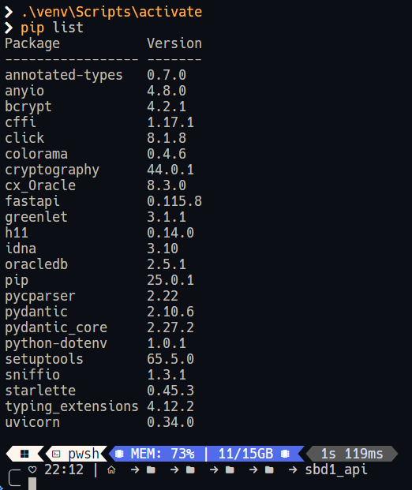
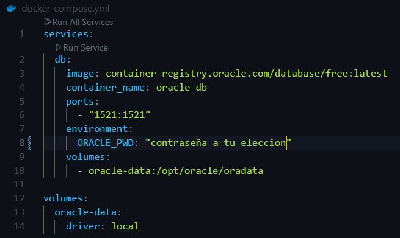
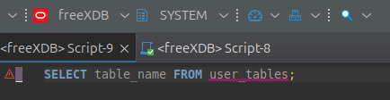
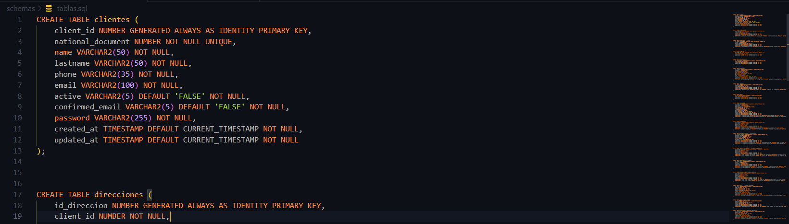
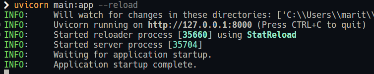
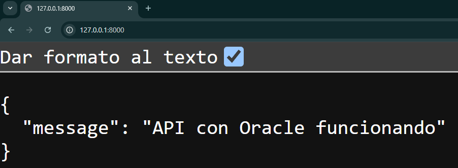
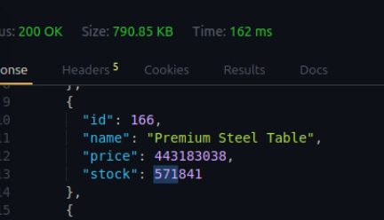
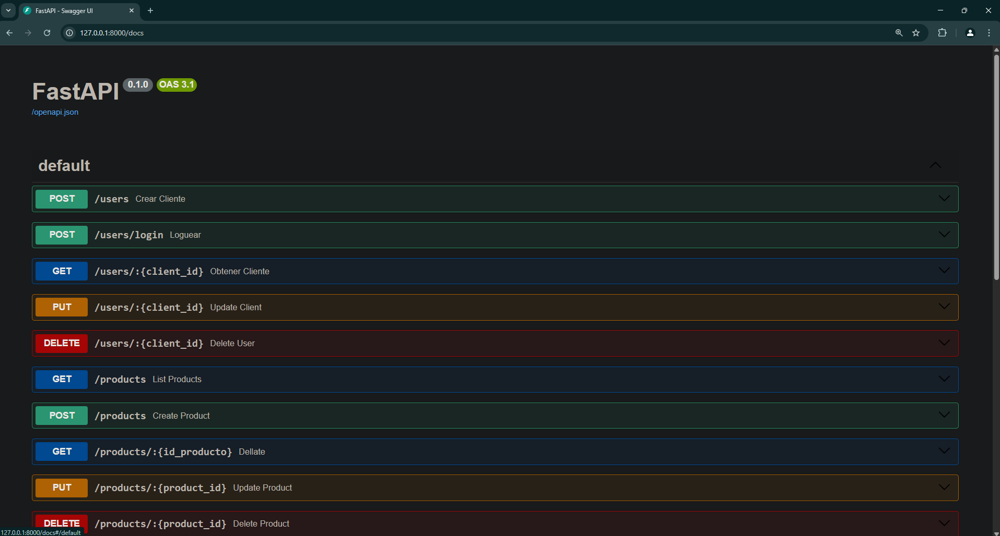

# <center>Manual de Usuario</center>

## Descripción 
Este proyecto consiste en el desarrollo de una base de datos y una API para gestionar información de trabajdores, compras y usuarios; gestinando sus envíos y pagos.

## Crear entorno virtual:
```bash
    python -m venv venv
```

## Activar entorno virtual:
```bash
    ./venv/Scripts/activate #Si estás en windows
    source ./venv/bin/activate #Si estás en linux
```

Una vez está activado el entorno virutal, deberías de ver (venv) si estás en linux. Si te encuentras en windows puedes realizar este comando "pip list" para visualizar si estás dentro del entorno virtual.




## Instalar dependencias:
Dentro de la carpeta donde está tu entorno de python ejecutas los siguientes comandos para instalar las librerías correspondientes:
```bash
    cd proyecto/sbd1_api
    pip install -r requirements.txt
```


## Configurar la base de datos:
- Se dispone de un archivo docker-compse que descarga la imagen de oracle para ser ejecutada en un contenedor:<br>
    

- Crear una base de datos en Oracle con el nombre de tu preferencia.

- Puedes usar datagrip o dbeaver para conectarte:<br>
    

- Ejecutar el script de creación de tablas ubicado en schemas/tablas.sql: <br>
    


## Estructura del Proyecto
- /data_modeler: Contiene los diseños para usar en datamodeler.
- /sbd1_api: Código fuente de la API.

## Uso del Proyecto
Para ejecutar el proyecto, utiliza el siguiente comando:
```bash
cd sbd1_api/app
uvicorn main:app --reload
```
Esto inicializará la API y podrás visualizar en tu consola que está funcionando:
    <br>

Puedes probar la API en tu navegador ingresando la dirección en tu consola y visualizarás lo siguiente:
<br>

# Descripción de la API
 La API gestiona información de compras, usuarios, productos, órdenes y pagos. A continuación, se escriben los endpoints disponibles y se proporciona un ejemplo de cada uno:

## Gestión de Usuarios

### Crear Usuario (Registro) (POST)  /users

Crea un nuevo usuario en la plataforma.

```json
{
  "national_document": 0,
  "name": "string",
  "lastname": "string",
  "phone": "string",
  "email": "string",
  "active": "string",
  "confirmed_email": "string",
  "password": "string"
}
```
Respuesta:

```json
{
"status": 200,
"message": "User created successfully"
}
```

### Iniciar Sesión (Login) (POST) /users/login

Autentica un usuario comparando la contraseña con el hash, EL USERNAME ES EL NATIONAL_DOCUMENT

```json
{
  "username": 0,
  "password": "string"
}
```

Respuesta:

```json
{ 
"status": "success", 
"message": "User authenticated", 
"sessionId": "abc123" 
}
```

### Obtener Perfil de Usuario (GET) /users/:id

Obtiene la información de un usuario específico (datos básicos, sin exponer contraseña). Parámetro:id en la URL.

Respuesta:

```json
{
    "national_document": 678140640,
    "name": "Wesley Stevens",
    "lastname": "Swanson",
    "phone": "307-314-0134",
    "email": "[edward36@example.net](mailto:edward36@example.net)",
    "active": "True",
    "confirmed_email": "False",
    "created_at": "2024-01-27T15:46:26.060000",
    "update_at": "2025-02-11T02:25:42.631000"
}
```

### Actualizar Usuario (PUT) /users/:id

Modifica los datos de un usuario (excepto la contraseña).

```json
{
  "phone": 0,
  "email": "string"
}
```

Respuesta:

```json
{
"status": 200,
"message": "User updated successfully"
}
```

### Eliminar Usuario (DELETE) /users/:id

Elimina un usuario o lo marca como inactivo.

Respuesta:

```json
{
"status": 200,
"message": "User deleted successfully"
}
```

---

## Gestión de Productos

### Listar Productos (GET) /products

 Retorna la lista de productos.

```json
{
"products": [
    {
    "id": 115,
    "name": "Awesome Glass Shoes",
    "price": 343088659,
    "stock": 389847
    },
    …
    ]
}
```

### Detalle de Producto (GET) /products/:id

Obtiene el detalle de un producto específico.

Respuesta:

```json
{
"id": 115,
"name": "Awesome Glass Shoes",
"price": 343088659,
"description": "Near age court war entire hand. Law executive TV medical play. Feel other group writer stuff onto character people.\nLook amount reality camera. Possible only good any policy standard become.",
"stock": 389847,
"category": "Trendy Fitness"
}
```

### Crear Producto (POST) /products

Crea un nuevo producto (generalmente restringido a administradores o vendedores).

```json
{
  "name": "string",
  "description": "string",
  "price": 0,
  "sku": "string",
  "slug": "string",
  "active": "string",
  "stock": 0,
  "location": 0,
  "category": "string"
}
```

Respuesta:

```json
{
"status": 200,
"message": "Product created successfully",
"productId": 22223
}
```

### Actualizar Producto (PUT) /products/:id

 Modifica la información de un producto existente.

```json
{
  "name": "string",
  "description": "string"
}
```

Respuesta:

```json
{
"status": 200,
"message": "Product updated successfully"
}
```

### Eliminar Producto (DELETE) /products/:id

Elimina un producto de la base.

```json
{
"status": 200,
"message": "Product deleted successfully"
}
```

---

## Gestión de Órdenes

### Crear Órden de Compra (POST) /orders

Crea una nueva órden asociada a un usuario.

```json
{
    "userId": 11,
    "locationId": 2,
    "items": [
        {"productId": 10, "quantity": 2},
        {"productId": 2, "quantity": 1}
    ],
    "shippingAddress": "Calle 123, Ciudad",
    "paymentMethod": "bank"
}
```

Respuesta:

```json
{
"status": "success",
"message": "Order created successfully",
"orderId": 22223,
"totalAmount": 2561843516,
"orderStatus": "processing"
}
```

### Listar Órdenes (GET) /orders

Retorna un listado de órdenes. 

```json
{
    "orders":
    [
        {
        "orderId":22223,
        "userId":11,
        "totalAmount":2561843516.0,
        "status":"processing",
        "createdAt":"2025-03-05"
        },
        {
        "orderId":22222,
        "userId":2,
        "totalAmount":1841191903.0,
        "status":"processing",
        "createdAt":"2025-03-05"
        }
    ]
}
```

### Detalle de Órden (GET) /orders/:id

Muestra la información detallada de la órden, incluyendo ítems, cantidades, etc.

```json
{
"orderId": 1,
"userId": 387,
"items": [
{
"productId": 9652,
"quantity": 35990,
"price": 403581935.0
},
{
"productId": 9472,
"quantity": 22950,
"price": 282750624.0
},
{
"productId": 6564,
"quantity": 79081,
"price": 99703214.0
},
{
"productId": 1017,
"quantity": 89046,
"price": 448019251.0
},
{
"productId": 1213,
"quantity": 93651,
"price": 838240580.0
}
],
"totalAmount": 147295061309910,
"status": "pending",
"createdAt": "2024-01-31"
}
```

### Actualizar Estado de Órden (PUT) orders/:id

Permite cambiar el estado (processing, shipped, delivered,cancelled).

```json
{
"status":"FAIL"
}
```

Respuesta:

```json
{
"status": 200,
"message": "Estado de orden actualizada correctamente"
}
```

---

## Gestión de Pagos

### Registrar Pago (POST) /payments

Registra un pago asociado a una órden.

```json
{
"orderId": 101,
"method": "credit_card",
"status":"PAID"
}

```

Respuesta:

```json
{
"status": 200,
"message": "Payment registered successfully",
"paymentId": 
    [
        222228
    ]
}
```

### Consultar Pagos (GET) /payments

Lista los pagos realizados

Respuesta:

```json
{
    "payments":
    [
        {
        "payment_Id":402,
        "order_Id":9931,
        "method":"BANK",
        "status":"PENDING",
        "createdAt":"2020-02-28T22:24:38Z"
        },
        {
        "payment_Id":403,
        "order_Id":6072,
        "method":"BANK",
        "status":"PAID",
        "createdAt":"2022-06-02T19:56:40Z"
        }
        ...
    ]
}
```

---

Puedes realizar pruebas de los endpoints en postman o en thunderclient para probar los endpoints.<br>
<br>

Así mismo puedes aprovechar que FastAPI ofrece una automatización de la documentación de los endpoints utilizados a través del endpoint `/docs`
<br>

---
Este manual te ha guiado a través de los pasos necesarios para configurar y utilizar la API del proyecto. Hemos cubierto desde la creación y activación del entorno virtual, la instalación de dependencias, la configuración de la base de datos, hasta el uso de los diferentes endpoints disponibles en la API.

Esperamos que esta guía te haya sido útil y te permita aprovechar al máximo las funcionalidades de la API. Si tienes alguna pregunta o necesitas asistencia adicional, no dudes en contactar al equipo de soporte o consultar la documentación técnica proporcionada.
- ### [Manual técnico](/documentacion/tecnico.md) 
¡Gracias por utilizar nuestro sistema!

